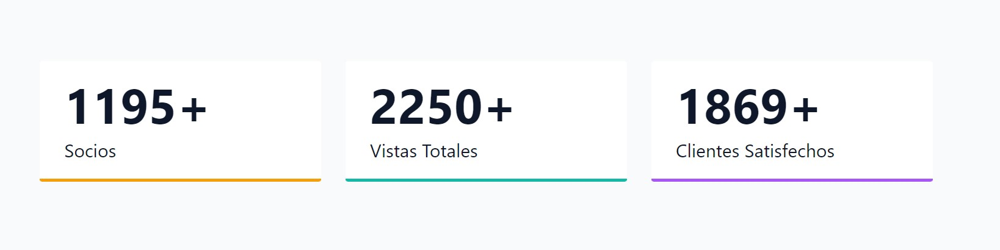

# Numeros-Estadisticos
Numeros Estadisticos que Incremenan a la vista, hecho en HTML, CSS y JS.
¿Quien no ha visto en paginas web el efecto de numeros de una estadistica que crecen hasta alcanzar un limite?

  

## ¿En que consiste este proyecto?
basicamente en mostrar 3 numeros que crecen hasta alcanzar un limite y señalan una estadistica, no tiene un fin mas complejo como proyecto de practica

## ¿Puedo ver en Acción este proyecto?
Si, haciendo click [aqui]()

## Referencias y Agradecimientos a:

-[john-smilga](https://github.com/john-smilga/javascript-basic-projects)
-[video de referencia de como llegue a este proyecto](https://www.youtube.com/watch?v=3PHXvlpOkf4&t=421s)

